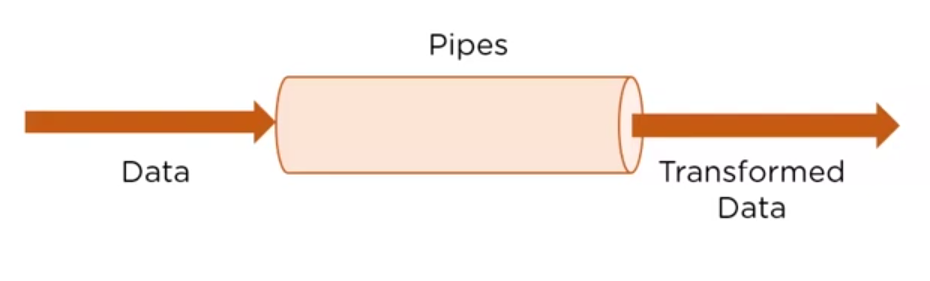

# Diretivas e Pipes

As [`Diretivas`](#diretivas) podem realizar diversas funções no sistema, **como aplicar estilos a um elemento, aplicar classes css a um elemento, etc**. Já os [`Pipes`](#pipes), são ferramentas para trabalhar com d**ados no templade do componente**.

A maioria das diretivas e pipes já vem importada junto com o `CommonModule`.

## Diretivas

As diretivas começam sempre com `ng`. Por exemplo: `ngAlgumaCoisa`, `ngStyle`, `ngClass`, etc.

Exemplo prático:

```
<h2 [ngStyle]="{ 'font-size': '12px', 'color': 'black' }">
    Testando diretiva de estilos / style
</h2>
```
`componente-generico.html`

## Pipes

Os Pipe Operators são recursos para trabalhar com dados. Aceitam um valor de entrada, processam e retornam um valor transformado.



- Pipes são definidos usando o símbolo pipe "|". Mas, é possível criar pipes personalizados.
- Podem ser encadeados com outros pipes.
- Podem receber argumentos usando o símbolo de dois pontos (:).

### Principais Pipes

- DatePipe: Formata um valor de data.
- UpperCasePipe: Transforma um texto em caixa alta.
- LouwerCasePipe: Transforma um texto em caixa baixa.
- CurrencyPipe: Transforma um número para uma string de moeda.
- DecimalPipe: Transforma um número numa string com um ponto decimal.
- PercentPipe: Tranforma um número para uma string percentual.